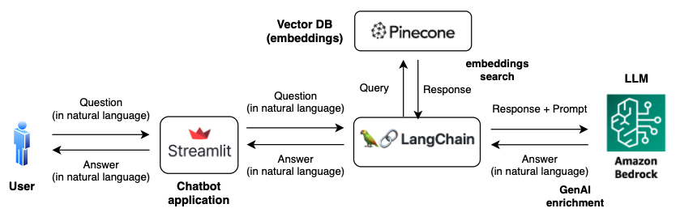

# Document Chatbot - Retrieval Augmented Generation (RAG) with Amazon Bedrock

This repo is an example application for performing embeddings-based search and enriching the responses with Generative AI.

The notebook explains the process for ingesting documents to the vector/embeddings database, chaining this as a retriever in Langchain, and connecting it to a Large Language Model (LLM). It also includes a Streamlit app for the user chatbot interaction.

* Vector database used: Pinecone
* LLM: Amazon Bedrock - Anthropics Claude

