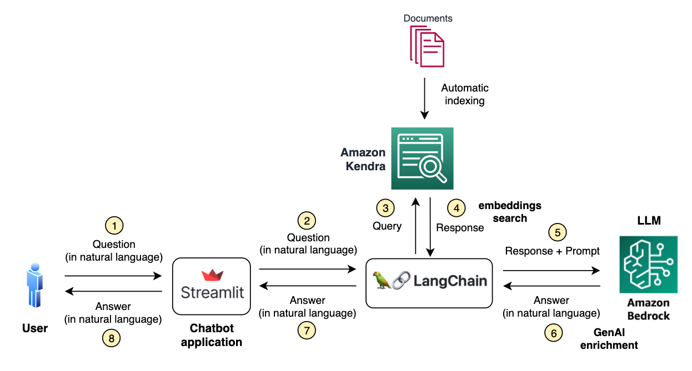
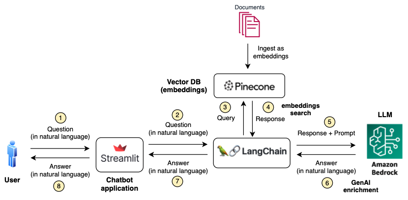

# Document Chatbot - Retrieval Augmented Generation (RAG) with Amazon Bedrock

This repo is an example application for performing embeddings-based search and enriching the responses with Generative AI in AWS.

The sample notebooks explains the process for ingesting documents to the vector/embeddings database, chaining this as a retriever in Langchain, and connecting it to a Large Language Model (LLM). It also includes a Streamlit app for the user chatbot interaction.

Samples are provided with two options:
* Fully managed with [Amazon Kendra](https://docs.aws.amazon.com/kendra/): [RAG Kendra sample notebook](./langchain-kendra-retrieval.ipynb)

* BYO vector database with [Pinecone](https://aws.amazon.com/marketplace/pp/prodview-xhgyscinlz4jk): [RAG Pinecone sample notebook](./langchain-pinecone-retrieval.ipynb)

The LLM is [Amazon Bedrock](https://aws.amazon.com/bedrock/) in both cases. Notebooks are configured for using Anthropics Claude v2 in Bedrock, but you can change it for any model supported in the service.

